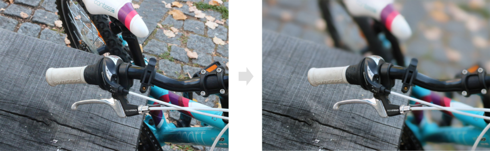
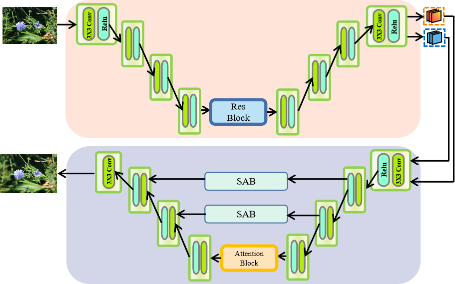

# 2022 AIM Bokeh Effect Rendering Challenge——Attention-based Double V-Net

## 一、What is Bokeh Effect Rendering?

The bokeh effect is always used to describe such a scenario: When you take pictures using an SLR camera, there would be blurred objects that are not in the focal plane of the camera. Like below:

Currently, many SLR cameras support full-depth focus. That's to say, images taken by those cameras contain less blurred area as they have a bigger DOF(depth of field). However, sometimes people want real-world bokeh effect because they look more beautiful. That's what this challenge needs us to do, i.e., try to realize a real-world bokeh effect rendering!

## 二、Method

The easiest way for such a CV task is, of course, deep learning. Here, we first thank Doctor Qianming(email:mingqian@whu.edu.cn), our work is based on his.  We apply a GAN framework for supervised learning, you can find details in paper*<<BGGAN: Bokeh-Glass Generative Adversarial Network for Rendering Realistic Bokeh>>*. We modify the generator as below:

## 三、Train and use our pre-trained model to do inference

Our folder structure is very simple, the model file contains *discriminator.py*, *ourmodel_v3.py*. The dataset loader is defined in *dataset.py*. And the Solver for training is defined in *train.py*. Those are the codes we used to do experiments, so we do not add any *args_parser*. First, you need to modify *train.py* if you want to use your own dataset, and the dataset folder should be organized as follows:

- /root_path
  - train
    - input
      - 1.png
      - 2.png
      - ...
    - label
      - 1.png
      - 2.png
      - ....
  - val

the path parameter should be "root_path/train", we provide a parameter *split* if your validation data are split from training data, or you can define a new function to read image data from your own val data. More details about the dataset can be found in *dataset.py*.

Our code is simple, the only command you need for training is:

*python3 train.py*

But before that, you need to check whether file directories mentioned in the code exist on your OS.

If you want a direct inference, download the pre-trained model here:

https://drive.google.com/file/d/1pqtckHeMqPs1JF8lXJQEh2Yb9n335Vbt/view?usp=sharing

then modify *inference.py* . The pre-trained model path is your path, and the image folder also should be your path. You can also modify the output dir if you want, otherwise the default dir would be *pretrained_model_dir/test_result/*

Requirements:

- tensorflow >=2.5
- keras compatible with tensorflow
- cv2, glob, and other normal packages you need

Our model is implemented in Tensorflow, so if you want to design your own model, use Tensorflow too. We never use Pytorch to implement this model, so we won't know issues you meet.